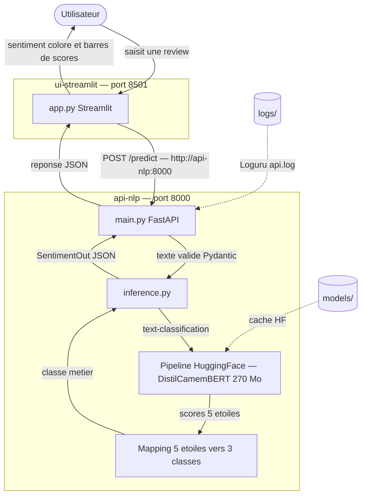

# FastIA — Analyse de sentiment FR · Aubergine Hôtels

Service NLP embarqué qui lit les reviews clients en français et les classe automatiquement en **négatif / neutre / positif** — sans cloud, sans clé API, entièrement conteneurisé.

Projet réalisé dans le cadre du brief **M0-B2** (Formation Dev-ID, juin 2026) — Nawelle Polin.

---

## Sommaire

- [Description](#description)
- [Architecture](#architecture)
- [Prérequis](#prérequis)
- [Installation](#installation)
- [Utilisation](#utilisation)
- [Tests](#tests)
- [Roadmap](#roadmap)
- [Retours d'expérience](#retours-dexpérience)
- [Licence](#licence)
- [Contact](#contact)

---

## Description

Aubergine Hôtels reçoit des centaines de reviews clients chaque semaine. L'objectif est d'automatiser leur qualification sans dépendre d'un service externe.

Ce projet expose deux services Docker :

- **`api-nlp`** — une API FastAPI qui reçoit un texte FR, l'analyse avec un modèle CamemBERT et renvoie un sentiment métier en JSON.
- **`ui-streamlit`** — une interface web qui permet à n'importe quel collaborateur de coller une review et d'obtenir le résultat immédiatement.

Le modèle [`cmarkea/distilcamembert-base-sentiment`](https://huggingface.co/cmarkea/distilcamembert-base-sentiment) produit nativement 5 classes (étoiles). Un **mapping métier 5★ → 3 classes** est appliqué côté API pour coller au besoin d'Aubergine Hôtels.

---

## Architecture



Les deux conteneurs partagent le réseau bridge `m0b2-net` — l'UI appelle l'API via le nom de service `api-nlp`, jamais via `localhost`.

---

## Prérequis

| Outil | Version min | Vérification |
|---|---|---|
| Docker | 24.x | `docker --version` |
| Docker Compose | 2.x (plugin V2) | `docker compose version` |
| RAM disponible | ≥ 2 Go | Pour charger le modèle CamemBERT |
| Connexion internet | — | Uniquement au 1er démarrage (download ~270 Mo) |

Pas de Python local requis — tout tourne dans les conteneurs.

---

## Installation

```bash
# 1. Cloner le dépôt
git clone https://github.com/nawellepolin/M0-B2-sentiment-nawelle.git
cd M0-B2-sentiment-nawelle

# 2. Créer le fichier d'environnement
cp .env.example .env
# Éditer .env si besoin (MODEL_NAME_HF, MAX_TEXT_LENGTH)

# 3. Lancer la stack
docker compose up --build
```

> Le **premier démarrage** prend 5 à 8 minutes : build des images + téléchargement du modèle (~270 Mo).
> Les démarrages suivants sont inférieurs à 30 secondes grâce au volume `models/`.

Pour vérifier que tout est en ordre :

```bash
docker compose ps
# api-nlp doit afficher (healthy)
```

Arrêt propre :

```bash
# Ctrl+C puis :
docker compose down
# Les volumes models/ et logs/ sont conservés
```

---

## Utilisation

### Interface web

Ouvrir [http://localhost:8501](http://localhost:8501) — coller une review FR, cliquer sur **Analyser**.

Le résultat affiche :
- le sentiment détecté en couleur (rouge / orange / vert)
- les probabilités brutes 5 étoiles sous forme de graphique à barres
- la latence d'inférence et le nom du modèle

### API REST

Documentation interactive disponible sur [http://localhost:8000/docs](http://localhost:8000/docs).

#### `GET /health`

```bash
curl http://localhost:8000/health
```

```json
{ "status": "ok", "model_loaded": true }
```

#### `GET /info`

```bash
curl http://localhost:8000/info
```

```json
{
  "service": "FastIA Aubergine — sentiment FR",
  "model_name": "cmarkea/distilcamembert-base-sentiment",
  "native_classes": ["1 star", "2 stars", "3 stars", "4 stars", "5 stars"],
  "target_classes": ["négatif", "neutre", "positif"],
  "max_text_length": 2000
}
```

#### `POST /predict`

```bash
curl -X POST http://localhost:8000/predict \
  -H "Content-Type: application/json" \
  -d '{"texte": "Chambre propre, personnel très accueillant, on reviendra !"}'
```

```json
{
  "sentiment": "positif",
  "scores_5_stars": {
    "1 star": 0.012,
    "2 stars": 0.018,
    "3 stars": 0.054,
    "4 stars": 0.201,
    "5 stars": 0.715
  },
  "model_name": "cmarkea/distilcamembert-base-sentiment",
  "latence_ms": 142.3
}
```

| Champ | Type | Description |
|---|---|---|
| `texte` | `string` | Review FR, 1 à 2000 caractères |

| Champ réponse | Type | Description |
|---|---|---|
| `sentiment` | `"négatif"` \| `"neutre"` \| `"positif"` | Classe métier |
| `scores_5_stars` | `dict[str, float]` | Probabilités brutes du modèle (somme ≈ 1) |
| `latence_ms` | `float` | Temps d'inférence en millisecondes |

### Mapping 5★ → 3 classes

Le modèle produit une probabilité par étoile. Le mapping retenu est une moyenne pondérée par groupe :

| Classe métier | Formule |
|---|---|
| `négatif` | moyenne(1★, 2★) |
| `neutre` | moyenne(2★, 3★, 4★) |
| `positif` | moyenne(4★, 5★) |

La classe retenue est celle dont la moyenne est la plus élevée. Les étoiles 2★ et 4★ sont partagées entre deux groupes pour lisser les cas ambivalents — une frontière brutale produirait trop de faux neutres sur des reviews à polarité faible.

### Variables d'environnement

| Variable | Défaut | Usage |
|---|---|---|
| `MODEL_NAME_HF` | `cmarkea/distilcamembert-base-sentiment` | Modèle HuggingFace à charger |
| `MAX_TEXT_LENGTH` | `2000` | Longueur max du texte accepté |

---

## Tests

Les tests tournent **dans le conteneur** (le modèle doit être chargé) :

```bash
docker compose exec api-nlp pytest -v
```

| Fichier | Ce qui est testé |
|---|---|
| `tests/test_health.py` | `GET /health` → 200, `model_loaded: true` |
| `tests/test_predict.py` | `POST /predict` → 200, `sentiment` dans les 3 classes valides |

---

## Analyse des reviews mal classées

> Tâche async B — à compléter

Trois cas extraits de `data/sample_reviews.csv` où le modèle se trompe, avec hypothèse typée.

### Cas 1 — Ironie / sarcasme

```
Review    : "Vraiment super ! On nous a volé nos effets personnels dans la chambre
             et la sécurité n'a pas réagi, génial je recommande !"
Prédit    : positif (5★ : 90,4% — 4★ : 9,0%)
Attendu   : négatif
Hypothèse : ironie — les marqueurs de surface ("Vraiment super !", "génial",
             "je recommande") sont tous positifs, ce qui trompe le modèle.
             CamemBERT capte la polarité lexicale mais ne détecte pas le
             sarcasme sans contexte pragmatique. La gravité du contenu
             (vol, absence de réaction sécurité) est écrasée par les
             exclamations enthousiastes.
```

### Cas 2 — Négation / litote

```
Review    : "Je ne dirais pas que c'était un mauvais hôtel."
Prédit    : négatif (2★ : 38,3% — 1★ : 33,3%)
Attendu   : neutre
Hypothèse : négation — le modèle accroche sur le mot "mauvais" et
             l'associe à une polarité négative sans traiter la négation
             "ne...pas" qui l'annule. La phrase est en réalité une litote
             signifiant "c'était correct". CamemBERT peine à résoudre la
             portée de la négation longue distance sur un adjectif négatif.
```

### Cas 3 — Comparatif / attentes dépassées

```
Review    : "Moins bien que l'hôtel où on était l'année dernière, mais
             vraiment mieux que ce à quoi je m'attendais pour ce prix."
Prédit    : neutre (3★ : 47,8% — 4★ : 35,4%)
Attendu   : positif
Hypothèse : comparatif — la phrase contient deux comparaisons de sens
             opposé. Le modèle les moyenne et atterrit sur neutre. Mais
             la seconde partie ("vraiment mieux que ce à quoi je
             m'attendais pour ce prix") porte le signal émotionnel fort :
             attentes dépassées = satisfaction. CamemBERT ne résout pas
             la hiérarchie sémantique entre les deux propositions et traite
             "moins bien" et "vraiment mieux" comme des signaux de poids égal.
```

### Cas 4 — Mixte / signal bloquant noyé

```
Review    : "Personnel adorable et chambre impeccable, mais il faisait
             beaucoup trop chaud sans la clim, je n'ai pas dormi de la nuit."
Prédit    : neutre (3★ : 48,4% — 2★ : 36,2%)
Attendu   : négatif
Hypothèse : mixte — la review contient deux blocs de polarité opposée
             séparés par "mais". Le modèle équilibre les deux et atterrit
             sur neutre. Or "je n'ai pas dormi de la nuit" est un signal
             bloquant : une nuit sans sommeil annule objectivement les
             points positifs sur la chambre et le personnel. Le modèle
             traite tous les tokens avec un poids uniforme et ne hiérarchise
             pas le degré de gravité des critiques.
```

### Cas 5 — Ambivalence / sous-entrendu négatif

```
Review    : "Disons que ça fait le travail. Rien à signaler de particulier."
Prédit    : positif (4★ : 58,8% — 5★ : 20,9%)
Attendu   : neutre
Hypothèse : ambivalence — la formulation est volontairement vague et peu
             enthousiaste. "Ça fait le travail" et "rien à signaler" sont
             des expressions de satisfaction minimale, proches du neutre
             teinté de déception. Le modèle interprète l'absence de mots
             négatifs explicites comme un signal positif et sur-classifie
             en positif. Il ne capte pas le sous-entendu implicite : quand
             un client ne trouve rien à dire, c'est rarement un compliment.
```

### Cas 6 — Hors-sujet / bruit contextuel

```
Review    : "J'ai passé un après-midi incroyable à la plage, il faisait bon
             et j'ai adoré jouer dans les vagues. Hotel pas fou."
Prédit    : positif (5★ : 43,6% — 4★ : 28,0%)
Attendu   : négatif
Hypothèse : hors-sujet — la majorité du texte décrit une expérience
             extérieure à l'hôtel (la plage, la météo, les vagues), avec
             un vocabulaire très positif ("incroyable", "adoré", "bon").
             Le jugement réel sur l'hôtel — "Hotel pas fou" — est court,
             en fin de phrase, et noyé dans le bruit contextuel positif.
             Le modèle pondère tous les tokens sans distinguer ce qui
             concerne l'établissement de ce qui est hors périmètre.
```

---

## Roadmap

| Priorité | Fonctionnalité | Statut |
|---|---|---|
| Critique | Mapping 5★ → 3 classes implémenté et justifié | Fait |
| Critique | UI Streamlit branchée à l'API | Fait |
| Critique | ≥ 3 tests pytest qui passent | Fait |
| Critique | Analyse des reviews mal classées (≥ 3 cas) | En cours |
| Important | Collection Postman complète (≥ 5 requêtes, cas limites) | À faire |
| Bonus | Healthcheck custom avec retry | À faire |
| Bonus | Endpoint `POST /predict/batch` | À faire |
| Bonus | Justification CamemBERT vs LLM (½ page) | À faire |

---

## Licence

Usage interne formation — non destiné à la distribution publique.

---

## Contact

**Nawelle Polin** — [npolin@dev-id.fr](mailto:npolin@dev-id.fr)

Formation Dev-ID · Brief M0-B2 · Juin 2026
